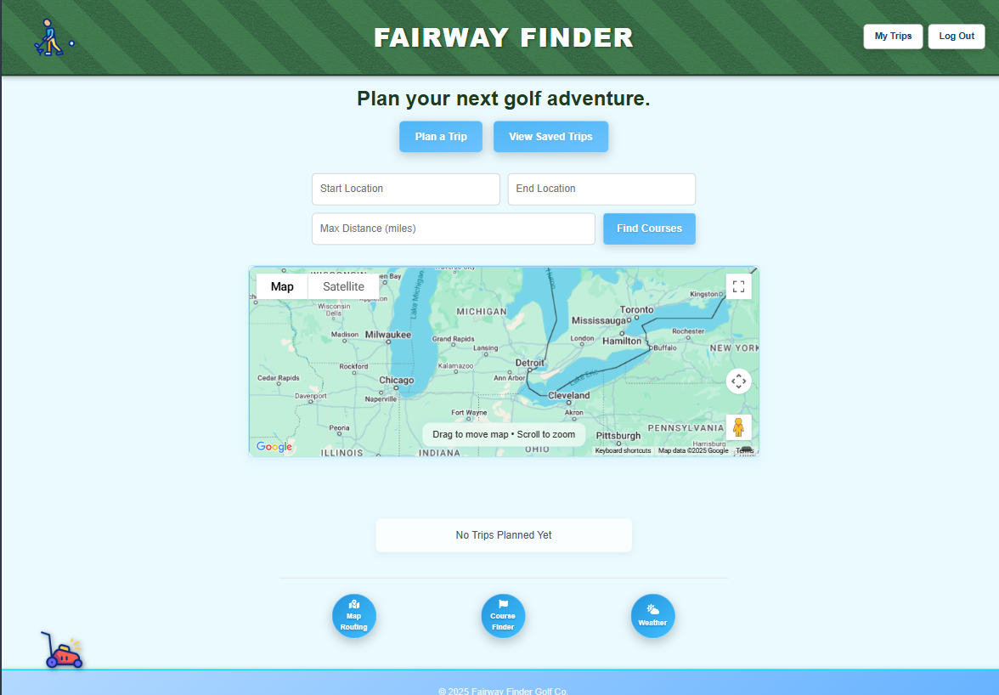

# 🏌️‍♂️ Fairway Finder

A modern, full-stack golf trip planner built by **Bryen “BryGuy” Gatt**. Search and save courses, plan driving routes, check tee-off weather, and calculate handicaps—all with instant, secure authentication and a polished, responsive interface.

---

## 📸 Screenshot

  

---

## 🎯 Elevator Pitch

Fairway Finder is a single-page MERN application that streamlines golf trip planning by combining course lookup, route mapping, weather forecasting, and handicap calculation into one intuitive platform. With real-time API integrations and a seamless user experience, everything you need is at your fingertips.

---

## 💡 Concept & Motivation

Planning a golf trip often means juggling multiple tools—course details, directions, weather, and handicaps. Fairway Finder removes that complexity. By integrating Google Maps, OpenWeather, and the Golf Course API, it provides a single, cohesive solution for organizing every aspect of your golf outing.

---

## 🛠️ Core Features

- **Instant Authentication (JWT)**  
  Secure sign-up, login, and logout without page reloads. React Context manages auth state so header buttons update immediately.

- **Course Finder (Golf Course API)**  
  Search by course name, view tee box ratings and slopes filtered by gender, and save selections directly to your trip itinerary.

- **Route Planning (Google Maps API)**  
  Plan driving routes with turn-by-turn directions and visualize nearby amenities (golf courses, gas stations, rest areas) along the way.

- **Weather Integration (OpenWeather API)**  
  Fetch 7-day forecasts and toggle between Fahrenheit and Celsius to view conditions for your chosen trip date.

- **Handicap Tracker (USGA Formula)**  
  Calculate your handicap index instantly using real-time slope and rating data, then save that information to your profile.

- **Discord Webhook Bot Integration**  
  Automatically post updates (e.g., commit messages or trip notifications) to a Discord channel via webhooks—legacy and webhook bot implementations supported.

- **Polished, Responsive UI**  
  Scoped CSS prevents style conflicts. Glass-inspired form cards, smooth focus and hover effects, and a consistent color palette deliver a professional, mobile-friendly interface.

---

## 🔧 Technology Stack

- **Frontend:**  
  React (TypeScript) · React Router v6 · Apollo Client (GraphQL) · CSS (Scoped selectors) · Google Maps JS API (@vis.gl/react-google-maps) · OpenWeather API

- **Backend:**  
  Node.js · Express.js · Apollo Server (GraphQL) · MongoDB (Mongoose) · JSON Web Tokens (JWT)

- **Discord Integration:**  
  Custom Discord Webhook Bot (legacy and webhook versions) for automated notifications and commit message postings.

- **Deployment & Tooling:**  
  Render (frontend & backend) · MongoDB Atlas · GitHub Actions (CI) · Environment variables to secure API keys

---

## 🚀 Live Demo & Repository

- **Live Site:** [https://fairway-finder.onrender.com](https://fairway-finder.onrender.com)  
- **MVP Site:** [https://fairway-finder-mvp.onrender.com](https://fairway-finder-mvp.onrender.com)  
- **GitHub:** [https://github.com/PHTMGatt/Fairway-Finder](https://github.com/PHTMGatt/Fairway-Finder)

---

## 🔮 Future Directions

- **Social Sharing:** Allow users to share golf itineraries via social media or unique trip links.  
- **Tee-Time Booking:** Integrate a real-time tee-time reservation API.  
- **Progressive Web App (PWA):** Add offline support and “Add to Home Screen” functionality for mobile users.

---

## 🧠 Credits

- **Primary Developer:** [Bryen “BryGuy” Gatt](https://github.com/PHTMGatt)  
- **Contributors:**  
  • [Jarred Hampton](https://github.com/Jarred13D)  
  • [Jared Owens](https://github.com/jaredowens)  
  • [Hunter West](https://github.com/Frankthedestro)  
  • [Nicholas Dear](https://github.com/n6dd)

---

© 2025 Fairway Finder. All rights reserved.
